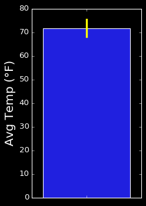

<h3>Project Title: PySurf_EDA</h3>


<b>Project Objective:</b> In this project, the goal was to understand basic sqlalchemy and how it can be used to query db's using python. After all the queries were performed, a Flask api was built using all the information collected during the analysis.

Tools Used: 
<ul>
<li>DB Browser for Sqlite </li>
<li>Jupyter notebook</li>
<li> Tableau</li>
<li> Excel </li>
</ul>

libraries used:
<ul>
<li>sqlalchemy </li>
<li>pandas </li>
<li>numpy </li>
<li>seaborn </li>
<li>matplotlib</li>
</ul>


<h3><u>Instructions</u></h3>


## Section 1 - Data Engineering

The climate data for Hawaii is provided through two CSV files. Start by using Python and Pandas to inspect the content of these files and clean the data.

* Create a Jupyter Notebook file called `data_engineering.ipynb` and use this to complete all of your Data Engineering tasks.

* Use Pandas to read in the measurement and station CSV files as DataFrames.

* Inspect the data for NaNs and missing values. You must decide what to do with this data.

* Save your cleaned CSV files with the prefix `clean_`.

---

## Section 2 - Database Engineering

Use SQLAlchemy to model your table schemas and create a sqlite database for your tables. You will need one table for measurements and one for stations.

* Create a Jupyter Notebook called `database_engineering.ipynb` and use this to complete all of your Database Engineering work.

* Use Pandas to read your cleaned measurements and stations CSV data.

* Use the `engine` and connection string to create a database called `hawaii.sqlite`.

* Use `declarative_base` and create ORM classes for each table.

  * You will need a class for `Measurement` and for `Station`.

  * Make sure to define your primary keys.

* Once you have your ORM classes defined, create the tables in the database using `create_all`.

---

## Section 3 - Climate Analysis and Exploration

You are now ready to use Python and SQLAlchemy to do basic climate analysis and data exploration on your new weather station tables. All of the following analysis should be completed using SQLAlchemy ORM queries, Pandas, and Matplotlib.

* Create a Jupyter Notebook file called `climate_analysis.ipynb` and use it to complete your climate analysis and data exporation.

* Choose a start date and end date for your trip. Make sure that your vacation range is approximately 3-15 days total.

* Use SQLAlchemy `create_engine` to connect to your sqlite database.

* Use SQLAlchemy `automap_base()` to reflect your tables into classes and save a reference to those classes called `Station` and `Measurement`.

## Precipitation Analysis

* Design a query to retrieve the last 12 months of precipitation data.

* Select only the `date` and `prcp` values.

* Load the query results into a Pandas DataFrame and set the index to the date column.

* Plot the results using the DataFrame `plot` method.


* Use Pandas to print the summary statistics for the precipitation data.

### Station Analysis

* Design a query to calculate the total number of stations.

* Design a query to find the most active stations.

  * List the stations and observation counts in descending order

  * Which station has the highest number of observations?

* Design a query to retrieve the last 12 months of temperature observation data (tobs).

  * Filter by the station with the highest number of observations.

  * Plot the results as a histogram with `bins=12`.

## Temperature Analysis

* Write a function called `calc_temps` that will accept a start date and end date in the format `%Y-%m-%d` and return the minimum, average, and maximum temperatures for that range of dates.

* Use the `calc_temps` function to calculate the min, avg, and max temperatures for your trip using the matching dates from the previous year (i.e. use "2017-01-01" if your trip start date was "2018-01-01")

* Plot the min, avg, and max temperature from your previous query as a bar chart.

  * Use the average temperature as the bar height.

  * Use the peak-to-peak (tmax-tmin) value as the y error bar (yerr).


## Section 4 - Climate App

Now that you have completed your initial analysis, design a Flask api based on the queries that you have just developed.

* Use FLASK to create your routes.

## Section 5 - Routes

* `/api/v1.0/precipitation`

  * Query for the dates and temperature observations from the last year.

  * Convert the query results to a Dictionary using `date` as the key and `tobs` as the value.

  * Return the json representation of your dictionary.

* `/api/v1.0/stations`

  * Return a json list of stations from the dataset.

* `/api/v1.0/tobs`

  * Return a json list of Temperature Observations (tobs) for the previous year

* `/api/v1.0/<start>` and `/api/v1.0/<start>/<end>`

  * Return a json list of the minimum temperature, the average temperature, and the max temperature for a given start or start-end range.

  * When given the start only, calculate `TMIN`, `TAVG`, and `TMAX` for all dates greater than and equal to the start date.

  * When given the start and the end date, calculate the `TMIN`, `TAVG`, and `TMAX` for dates between the start and end date inclusive.

## Analysis and Plots

<h2><u>Vacation Analysis</u></h2>

### Observed Temperature and Precipation for 10-01-2016 to 10-10-2016


```python

    I have decided to go on a 10 day vacation !!! 

```


## <u>Precipitation Analysis</ul>

## Plot Hawaii Precipation for 2016


## Summary for 2016 Precipation


## <u>Station Analysis</u>

### Design a query to calculate the total number of stations


```python
There are 9 weather stations in hawaii.
```

### <u>Plot Most Active Stations Dataframe</u>


```python
USC00519281 is the most active station
```

## <u>Temperature Analysis</u>
### Plot for 2016 Observed Temperatures in Hawaii


### In 2015, the average temperature in Hawaii was 74.1 °F with variation of +/- 19.9 °F. This sounds like perfect weather to me. 

```python
Hawaii gets two 👍 👍and two raised ✋ ✋.
```

    

### Plot 2016 Hawaii Temperature Observations for Station USC00519281


### Plot for tavg,tmin,and tmax for dates greater than or equal to input date


### Plot for tavg,tmin, and tmax for dates between input dates




<h3><u>Conclusion</u></h3>
<p>************************. The insights are below:</p>
<h4><u>Insights</u></h4>
<ul>
<li>In the Temperature vs. Latitude scatter plot, as the latitude increases the temperature increases.</li> 
<p><li>In the Wind Speed (mph) vs. Latitude scatter plot, the average when speed for all cities is fairly low.  </li><br>
<li>The wind speeds are higher on average at the north and south poles.</li>
</ul>

